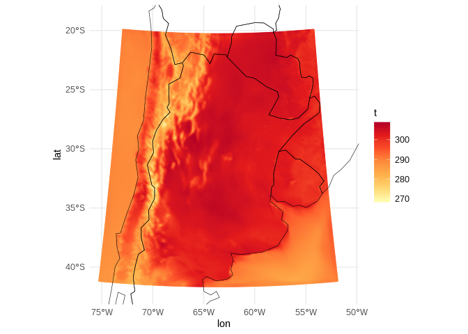
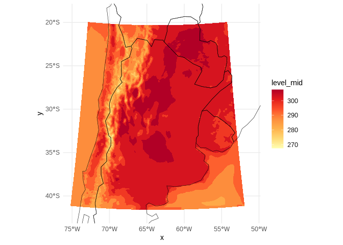

Ejemplo de lectura y graficado de salidas de WRF
================

## Lectura

Uso un archivo de ejemplo, el nombre engaña pero es un wrfout tal cual
devuelve la simulación.

``` r
ncfile <- "/home/paola.corrales/datosmunin/EXP/E6/ANA/20181120180000/analysis.ensmean"
```

Lo primero que hay que hacer es revisar los metadatos pero identificar
las dimensiones y los nombres de las variables que interesan. Si las
variables en el archivo tienen dimensiones distintas (y es lo que ocurre
en este caso ya que hay variables 2D y 3D) no vamos a poder leer el
archivo completo. Además cuando los archivos son muy grandes tampoco
conviene hacerlo por limitaciones de memoria.

``` r
GlanceNetCDF(ncfile) 
```

    ## ----- Variables ----- 
    ## Times:
    ##     Times
    ##     Dimensions: DateStrLen by Time
    ## XLAT:
    ##     XLAT in degree_north
    ##     Dimensions: west_east by south_north by Time
    ## XLONG:
    ##     XLONG in degree_east
    ##     Dimensions: west_east by south_north by Time
    ## LU_INDEX:
    ##     LU_INDEX
    ##     Dimensions: west_east by south_north by Time
    ## ZNU:
    ##     ZNU
    ##     Dimensions: bottom_top by Time
    ## ZNW:
    ##     ZNW
    ##     Dimensions: bottom_top_stag by Time
    ## ZS:
    ##     ZS in m
    ##     Dimensions: soil_layers_stag by Time
    ## DZS:
    ##     DZS in m
    ##     Dimensions: soil_layers_stag by Time
    ## VAR_SSO:
    ##     VAR_SSO in m2
    ##     Dimensions: west_east by south_north by Time
    ## U:
    ##     U in m s-1
    ##     Dimensions: west_east_stag by south_north by bottom_top by Time
    ## V:
    ##     V in m s-1
    ##     Dimensions: west_east by south_north_stag by bottom_top by Time
    ## W:
    ##     W in m s-1
    ##     Dimensions: west_east by south_north by bottom_top_stag by Time
    ## PH:
    ##     PH in m2 s-2
    ##     Dimensions: west_east by south_north by bottom_top_stag by Time
    ## PHB:
    ##     PHB in m2 s-2
    ##     Dimensions: west_east by south_north by bottom_top_stag by Time
    ## T:
    ##     T in K
    ##     Dimensions: west_east by south_north by bottom_top by Time
    ## HFX_FORCE:
    ##     HFX_FORCE in W m-2
    ##     Dimensions: Time
    ## LH_FORCE:
    ##     LH_FORCE in W m-2
    ##     Dimensions: Time
    ## TSK_FORCE:
    ##     TSK_FORCE in W m-2
    ##     Dimensions: Time
    ## HFX_FORCE_TEND:
    ##     HFX_FORCE_TEND in W m-2 s-1
    ##     Dimensions: Time
    ## LH_FORCE_TEND:
    ##     LH_FORCE_TEND in W m-2 s-1
    ##     Dimensions: Time
    ## TSK_FORCE_TEND:
    ##     TSK_FORCE_TEND in W m-2 s-1
    ##     Dimensions: Time
    ## MU:
    ##     MU in Pa
    ##     Dimensions: west_east by south_north by Time
    ## MUB:
    ##     MUB in Pa
    ##     Dimensions: west_east by south_north by Time
    ## NEST_POS:
    ##     NEST_POS in -
    ##     Dimensions: west_east by south_north by Time
    ## P:
    ##     P in Pa
    ##     Dimensions: west_east by south_north by bottom_top by Time
    ## PB:
    ##     PB in Pa
    ##     Dimensions: west_east by south_north by bottom_top by Time
    ## FNM:
    ##     FNM
    ##     Dimensions: bottom_top by Time
    ## FNP:
    ##     FNP
    ##     Dimensions: bottom_top by Time
    ## RDNW:
    ##     RDNW
    ##     Dimensions: bottom_top by Time
    ## RDN:
    ##     RDN
    ##     Dimensions: bottom_top by Time
    ## DNW:
    ##     DNW
    ##     Dimensions: bottom_top by Time
    ## DN:
    ##     DN
    ##     Dimensions: bottom_top by Time
    ## CFN:
    ##     CFN
    ##     Dimensions: Time
    ## CFN1:
    ##     CFN1
    ##     Dimensions: Time
    ## THIS_IS_AN_IDEAL_RUN:
    ##     THIS_IS_AN_IDEAL_RUN in -
    ##     Dimensions: Time
    ## P_HYD:
    ##     P_HYD in Pa
    ##     Dimensions: west_east by south_north by bottom_top by Time
    ## Q2:
    ##     Q2 in kg kg-1
    ##     Dimensions: west_east by south_north by Time
    ## T2:
    ##     T2 in K
    ##     Dimensions: west_east by south_north by Time
    ## TH2:
    ##     TH2 in K
    ##     Dimensions: west_east by south_north by Time
    ## PSFC:
    ##     PSFC in Pa
    ##     Dimensions: west_east by south_north by Time
    ## U10:
    ##     U10 in m s-1
    ##     Dimensions: west_east by south_north by Time
    ## V10:
    ##     V10 in m s-1
    ##     Dimensions: west_east by south_north by Time
    ## RDX:
    ##     RDX
    ##     Dimensions: Time
    ## RDY:
    ##     RDY
    ##     Dimensions: Time
    ## RESM:
    ##     RESM
    ##     Dimensions: Time
    ## ZETATOP:
    ##     ZETATOP
    ##     Dimensions: Time
    ## CF1:
    ##     CF1
    ##     Dimensions: Time
    ## CF2:
    ##     CF2
    ##     Dimensions: Time
    ## CF3:
    ##     CF3
    ##     Dimensions: Time
    ## ITIMESTEP:
    ##     ITIMESTEP
    ##     Dimensions: Time
    ## XTIME:
    ##     XTIME in minutes since 2018-11-20 12:00:00
    ##     Dimensions: Time
    ## QVAPOR:
    ##     QVAPOR in kg kg-1
    ##     Dimensions: west_east by south_north by bottom_top by Time
    ## QCLOUD:
    ##     QCLOUD in kg kg-1
    ##     Dimensions: west_east by south_north by bottom_top by Time
    ## QRAIN:
    ##     QRAIN in kg kg-1
    ##     Dimensions: west_east by south_north by bottom_top by Time
    ## QICE:
    ##     QICE in kg kg-1
    ##     Dimensions: west_east by south_north by bottom_top by Time
    ## QSNOW:
    ##     QSNOW in kg kg-1
    ##     Dimensions: west_east by south_north by bottom_top by Time
    ## QGRAUP:
    ##     QGRAUP in kg kg-1
    ##     Dimensions: west_east by south_north by bottom_top by Time
    ## SHDMAX:
    ##     SHDMAX
    ##     Dimensions: west_east by south_north by Time
    ## SHDMIN:
    ##     SHDMIN
    ##     Dimensions: west_east by south_north by Time
    ## SNOALB:
    ##     SNOALB
    ##     Dimensions: west_east by south_north by Time
    ## TSLB:
    ##     TSLB in K
    ##     Dimensions: west_east by south_north by soil_layers_stag by Time
    ## SMOIS:
    ##     SMOIS in m3 m-3
    ##     Dimensions: west_east by south_north by soil_layers_stag by Time
    ## SH2O:
    ##     SH2O in m3 m-3
    ##     Dimensions: west_east by south_north by soil_layers_stag by Time
    ## SMCREL:
    ##     SMCREL
    ##     Dimensions: west_east by south_north by soil_layers_stag by Time
    ## SEAICE:
    ##     SEAICE
    ##     Dimensions: west_east by south_north by Time
    ## XICEM:
    ##     XICEM
    ##     Dimensions: west_east by south_north by Time
    ## SFROFF:
    ##     SFROFF in mm
    ##     Dimensions: west_east by south_north by Time
    ## UDROFF:
    ##     UDROFF in mm
    ##     Dimensions: west_east by south_north by Time
    ## IVGTYP:
    ##     IVGTYP
    ##     Dimensions: west_east by south_north by Time
    ## ISLTYP:
    ##     ISLTYP
    ##     Dimensions: west_east by south_north by Time
    ## VEGFRA:
    ##     VEGFRA
    ##     Dimensions: west_east by south_north by Time
    ## GRDFLX:
    ##     GRDFLX in W m-2
    ##     Dimensions: west_east by south_north by Time
    ## ACGRDFLX:
    ##     ACGRDFLX in J m-2
    ##     Dimensions: west_east by south_north by Time
    ## ACSNOM:
    ##     ACSNOM in kg m-2
    ##     Dimensions: west_east by south_north by Time
    ## SNOW:
    ##     SNOW in kg m-2
    ##     Dimensions: west_east by south_north by Time
    ## SNOWH:
    ##     SNOWH in m
    ##     Dimensions: west_east by south_north by Time
    ## CANWAT:
    ##     CANWAT in kg m-2
    ##     Dimensions: west_east by south_north by Time
    ## SSTSK:
    ##     SSTSK in K
    ##     Dimensions: west_east by south_north by Time
    ## COSZEN:
    ##     COSZEN in dimensionless
    ##     Dimensions: west_east by south_north by Time
    ## LAI:
    ##     LAI in m-2/m-2
    ##     Dimensions: west_east by south_north by Time
    ## VAR:
    ##     VAR
    ##     Dimensions: west_east by south_north by Time
    ## MAPFAC_M:
    ##     MAPFAC_M
    ##     Dimensions: west_east by south_north by Time
    ## MAPFAC_U:
    ##     MAPFAC_U
    ##     Dimensions: west_east_stag by south_north by Time
    ## MAPFAC_V:
    ##     MAPFAC_V
    ##     Dimensions: west_east by south_north_stag by Time
    ## MAPFAC_MX:
    ##     MAPFAC_MX
    ##     Dimensions: west_east by south_north by Time
    ## MAPFAC_MY:
    ##     MAPFAC_MY
    ##     Dimensions: west_east by south_north by Time
    ## MAPFAC_UX:
    ##     MAPFAC_UX
    ##     Dimensions: west_east_stag by south_north by Time
    ## MAPFAC_UY:
    ##     MAPFAC_UY
    ##     Dimensions: west_east_stag by south_north by Time
    ## MAPFAC_VX:
    ##     MAPFAC_VX
    ##     Dimensions: west_east by south_north_stag by Time
    ## MF_VX_INV:
    ##     MF_VX_INV
    ##     Dimensions: west_east by south_north_stag by Time
    ## MAPFAC_VY:
    ##     MAPFAC_VY
    ##     Dimensions: west_east by south_north_stag by Time
    ## F:
    ##     F in s-1
    ##     Dimensions: west_east by south_north by Time
    ## E:
    ##     E in s-1
    ##     Dimensions: west_east by south_north by Time
    ## SINALPHA:
    ##     SINALPHA
    ##     Dimensions: west_east by south_north by Time
    ## COSALPHA:
    ##     COSALPHA
    ##     Dimensions: west_east by south_north by Time
    ## HGT:
    ##     HGT in m
    ##     Dimensions: west_east by south_north by Time
    ## TSK:
    ##     TSK in K
    ##     Dimensions: west_east by south_north by Time
    ## P_TOP:
    ##     P_TOP in Pa
    ##     Dimensions: Time
    ## T00:
    ##     T00 in K
    ##     Dimensions: Time
    ## P00:
    ##     P00 in Pa
    ##     Dimensions: Time
    ## TLP:
    ##     TLP
    ##     Dimensions: Time
    ## TISO:
    ##     TISO in K
    ##     Dimensions: Time
    ## TLP_STRAT:
    ##     TLP_STRAT in K
    ##     Dimensions: Time
    ## P_STRAT:
    ##     P_STRAT in Pa
    ##     Dimensions: Time
    ## MAX_MSTFX:
    ##     MAX_MSTFX
    ##     Dimensions: Time
    ## MAX_MSTFY:
    ##     MAX_MSTFY
    ##     Dimensions: Time
    ## RAINC:
    ##     RAINC in mm
    ##     Dimensions: west_east by south_north by Time
    ## RAINSH:
    ##     RAINSH in mm
    ##     Dimensions: west_east by south_north by Time
    ## RAINNC:
    ##     RAINNC in mm
    ##     Dimensions: west_east by south_north by Time
    ## SNOWNC:
    ##     SNOWNC in mm
    ##     Dimensions: west_east by south_north by Time
    ## GRAUPELNC:
    ##     GRAUPELNC in mm
    ##     Dimensions: west_east by south_north by Time
    ## HAILNC:
    ##     HAILNC in mm
    ##     Dimensions: west_east by south_north by Time
    ## CLDFRA:
    ##     CLDFRA
    ##     Dimensions: west_east by south_north by bottom_top by Time
    ## SWDOWN:
    ##     SWDOWN in W m-2
    ##     Dimensions: west_east by south_north by Time
    ## GLW:
    ##     GLW in W m-2
    ##     Dimensions: west_east by south_north by Time
    ## SWNORM:
    ##     SWNORM in W m-2
    ##     Dimensions: west_east by south_north by Time
    ## OLR:
    ##     OLR in W m-2
    ##     Dimensions: west_east by south_north by Time
    ## XLAT_U:
    ##     XLAT_U in degree_north
    ##     Dimensions: west_east_stag by south_north by Time
    ## XLONG_U:
    ##     XLONG_U in degree_east
    ##     Dimensions: west_east_stag by south_north by Time
    ## XLAT_V:
    ##     XLAT_V in degree_north
    ##     Dimensions: west_east by south_north_stag by Time
    ## XLONG_V:
    ##     XLONG_V in degree_east
    ##     Dimensions: west_east by south_north_stag by Time
    ## ALBEDO:
    ##     ALBEDO in -
    ##     Dimensions: west_east by south_north by Time
    ## CLAT:
    ##     CLAT in degree_north
    ##     Dimensions: west_east by south_north by Time
    ## ALBBCK:
    ##     ALBBCK
    ##     Dimensions: west_east by south_north by Time
    ## EMISS:
    ##     EMISS
    ##     Dimensions: west_east by south_north by Time
    ## NOAHRES:
    ##     NOAHRES in W m{-2}
    ##     Dimensions: west_east by south_north by Time
    ## TMN:
    ##     TMN in K
    ##     Dimensions: west_east by south_north by Time
    ## XLAND:
    ##     XLAND
    ##     Dimensions: west_east by south_north by Time
    ## UST:
    ##     UST in m s-1
    ##     Dimensions: west_east by south_north by Time
    ## PBLH:
    ##     PBLH in m
    ##     Dimensions: west_east by south_north by Time
    ## HFX:
    ##     HFX in W m-2
    ##     Dimensions: west_east by south_north by Time
    ## QFX:
    ##     QFX in kg m-2 s-1
    ##     Dimensions: west_east by south_north by Time
    ## LH:
    ##     LH in W m-2
    ##     Dimensions: west_east by south_north by Time
    ## ACHFX:
    ##     ACHFX in J m-2
    ##     Dimensions: west_east by south_north by Time
    ## ACLHF:
    ##     ACLHF in J m-2
    ##     Dimensions: west_east by south_north by Time
    ## SNOWC:
    ##     SNOWC
    ##     Dimensions: west_east by south_north by Time
    ## SR:
    ##     SR in -
    ##     Dimensions: west_east by south_north by Time
    ## SAVE_TOPO_FROM_REAL:
    ##     SAVE_TOPO_FROM_REAL in flag
    ##     Dimensions: Time
    ## ISEEDARR_SPPT:
    ##     ISEEDARR_SPPT
    ##     Dimensions: bottom_top by Time
    ## ISEEDARR_SKEBS:
    ##     ISEEDARR_SKEBS
    ##     Dimensions: bottom_top by Time
    ## ISEEDARR_RAND_PERTURB:
    ##     ISEEDARR_RAND_PERTURB
    ##     Dimensions: bottom_top by Time
    ## ISEEDARRAY_SPP_CONV:
    ##     ISEEDARRAY_SPP_CONV
    ##     Dimensions: bottom_top by Time
    ## ISEEDARRAY_SPP_PBL:
    ##     ISEEDARRAY_SPP_PBL
    ##     Dimensions: bottom_top by Time
    ## ISEEDARRAY_SPP_LSM:
    ##     ISEEDARRAY_SPP_LSM
    ##     Dimensions: bottom_top by Time
    ## BF:
    ##     BF in Dimensionless
    ##     Dimensions: bottom_top_stag by Time
    ## C1H:
    ##     C1H in Dimensionless
    ##     Dimensions: bottom_top by Time
    ## C2H:
    ##     C2H in Pa
    ##     Dimensions: bottom_top by Time
    ## BH:
    ##     BH in Dimensionless
    ##     Dimensions: bottom_top by Time
    ## C1F:
    ##     C1F in Dimensionless
    ##     Dimensions: bottom_top_stag by Time
    ## C2F:
    ##     C2F in Pa
    ##     Dimensions: bottom_top_stag by Time
    ## C3H:
    ##     C3H in Dimensionless
    ##     Dimensions: bottom_top by Time
    ## C4H:
    ##     C4H in Pa
    ##     Dimensions: bottom_top by Time
    ## C3F:
    ##     C3F in Dimensionless
    ##     Dimensions: bottom_top_stag by Time
    ## C4F:
    ##     C4F in Pa
    ##     Dimensions: bottom_top_stag by Time
    ## PCB:
    ##     PCB in Pa
    ##     Dimensions: west_east by south_north by Time
    ## PC:
    ##     PC in Pa
    ##     Dimensions: west_east by south_north by Time
    ## LANDMASK:
    ##     LANDMASK
    ##     Dimensions: west_east by south_north by Time
    ## LAKEMASK:
    ##     LAKEMASK
    ##     Dimensions: west_east by south_north by Time
    ## SST:
    ##     SST in K
    ##     Dimensions: west_east by south_north by Time
    ## SST_INPUT:
    ##     SST_INPUT in K
    ##     Dimensions: west_east by south_north by Time
    ## 
    ## 
    ## ----- Dimensions ----- 
    ##   Time: 1 values from 1 to 1 
    ##   DateStrLen: 19 values from 1 to 19 
    ##   west_east: 199 values from 1 to 199 
    ##   south_north: 239 values from 1 to 239 
    ##   bottom_top: 37 values from 1 to 37 
    ##   bottom_top_stag: 38 values from 1 to 38 
    ##   soil_layers_stag: 4 values from 1 to 4 
    ##   west_east_stag: 200 values from 1 to 200 
    ##   south_north_stag: 240 values from 1 to 240

La lectura se realiza con la función `ReadNetCDF()` del paquete {metR},
que tiene un argumento `vars` para indicar que variables quiero leer. En
este caso también les estoy cambiando el nombre para que sea más simple
escribirlas luego. Adicionalmente se podría leer solo una parte del
dominio, algún nivel específico o un tiempo en particular con el
argumento `subset`.

``` r
salida <- ReadNetCDF(ncfile, vars = c(p = "P", "PB", t = "T", qv = "QVAPOR", 
                                    lon = "XLONG", lat = "XLAT")) 
```

Los wrfout guardan determinadas variables necesarias para la simuación
pero no siempre son las que necesitamos para analizar, por eso puede
llegar a ser útil “postprocesar” algunas variables y para eso hay
algunas funciones disponibles en el archivo postprocesamiento.R

``` r
salida <- salida %>% 
  mutate(p = p + PB,                 # Presión
         t = tk(t, p),               # Temperatura (K)
         rh = rh(qv, p, t),          # Humedad relativa
         td = td(qv, p) + 273.15,    # Temperatura de rocío
         PB = NULL,                  # Ya no necesito PB
         u = uvmet(ncfile)[[1]],     # viento zonal rotado
         v = uvmet(ncfile)[[2]])     # viento meridional rotado
```

## Graficado

Vamos a necesitar un mapa, hay muchas maneras de obtenerlo, en este caso
usamos el paquete {rnaturalearth}

``` r
mapa <- rnaturalearth::ne_countries(country = c("argentina", "chile", "uruguay", 
                                                "paraguay", "brazil", "bolivia", 
                                                "falkland islands"), 
                                    returnclass = "sf")
```

Idealmente si vamos a graficar un campo de una variable queremos
contornos, el problema es que las geometrias de contornos no se llevan
muy bien con grillas irregulares. La reticula del modelo es irregular en
el espacio de las coordenadas cartesianas porque están proyectadas
(seguramnete usando Lambert).

Una solución rápida es usar puntos, pero el resultado no es ideal.

``` r
salida %>% 
  filter(bottom_top == 1) %>%   # Primer nivel del modelo
  ggplot(aes(lon, lat)) +
  geom_point(aes(color = t), size = 0.5) +
  scale_color_distiller(palette = "YlOrRd", direction = 1) +
  geom_sf(data = mapa, inherit.aes = FALSE, fill = NA, color = "black", size = 0.2) +
  coord_sf(xlim = c(-75, -51), ylim = c(-42, -19)) +
  theme_minimal()
```

<!-- -->

Si se quieren usar contornos primero es necesario reproyectar la
reticula del modelo a coordenadas geográficas. Para esto se usa un
paquete {proj4} y por suerte en postprocesamiento.R hay una función que
hace casi todo. Para esto necesitamos la información de la proyección
usada (todo está en los namelists y además en los metadatos del
wrfout\!). Para este ejemplo la proyección es:

``` r
map_proj <- "+proj=lcc +lat_1=-30.9659996032715 +lat_2=-30.9659996032715 +lat_0=-30.9660034179688 +lon_0=-63.5670013427734 +a=6370000 +b=6370000"
```

Con esa información puedo reproyectar los datos y generar dos nuevas
colunas x e y.

``` r
salida <- salida %>% 
  mutate(x = wrf_project(lon, lat, map_proj)[[1]],
         y = wrf_project(lon, lat, map_proj)[[2]])
```

Ahora si, se puede usar `geom_cotour_fill()` de {metR} para graficar los
contornos.

``` r
salida %>% 
  filter(bottom_top == 1) %>%   # Primer nivel del modelo
  ggplot(aes(x, y)) +
  geom_contour_fill(aes(z = t), proj = map_proj) +
  scale_fill_distiller(palette = "YlOrRd", direction = 1) +
  geom_sf(data = mapa, inherit.aes = FALSE, fill = NA, color = "black", size = 0.2) +
  coord_sf(xlim = c(-75, -51), ylim = c(-42, -19)) +
  theme_minimal()
```

<!-- -->
